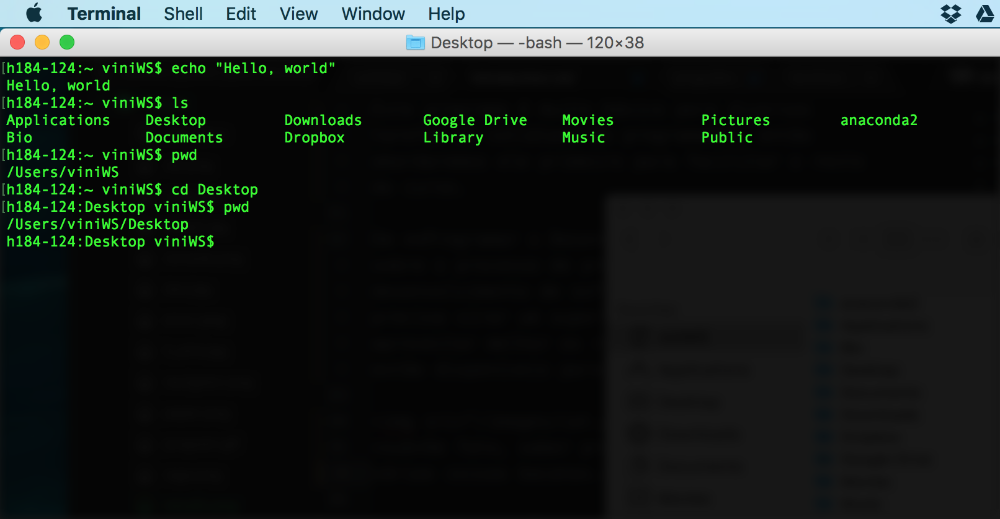

### Bem vindos ao Kit de Sobrevivência para Biólogos no Mundo da Informática
É evidente que, nos dias de hoje, os computadores são ferramentas básicas e fundamentais para o trabalho de biólogos e outros cientistas. Qualquer que seja a atividade profissional, de pesquisadoras de campo à professores à cientistas de bancada, alguma etapa do trabalho exige o uso de um computador. Tarefas como entrada de dados em planilhas, pesquisa bibliográfica e redação de documentos já são rotina para esses profissionais, além de outras mais complexas como análises estatísticas, manipulação de arquivos e modelagem.

No entanto, apesar da ubiquidade do seu uso, nossa formação não compreende o funcionamento e uso do computador, diferente de, por exemplo, um microscópio. Quando nos deparamos com desafios que exigem um pouco mais de conhecimento dos mistérios da informática, nem o mais complicado doutorado sobre filogeografia de nematódeos vai ser mais útil do que alguns truques que seriam básicos para qualquer estagiário de TI.

Se você veio fazer esse curso, são grandes as chances que você esteja usando alguma ferramenta informática que seja um pouco mais "avançada" do que o Excel. "Avançada" entre aspas por que na verdade muitas vezes essas ferramentas são super simples de se utilizar, porém requerem alguns conhecimentos prévios para sua instalação, implementação e execução. Talvez você esteja tendo que utilizar o pacote de métodos de alguma linguagem para aplicar uma análise estatística, ou tenha que formatar o script de algum doutorado que foi realizado no seu laboratório a anos atrás. Por mais que você pesquise e consiga resolver coisas bem específicas ao seu problema, existe a sensação de que você está deixando algo óbvio escapar, e que tornaria sua vida tão mais fácil.

É inevitável, em algum ponto ou outro da graduação nos depararmos com esses desafios da informática. E é normal que eles causem frustração. Não conseguir rodar um pacote, não conseguir fazer funcionar um script necessário para o processamento dos nossos dados, não conseguir instalar aquele programa obscuro baixado do site de algum laboratório que parece que não foi atualizado desde a época do DOS, ter problemas com driver de algum equipamento de laboratório, a lista se alonga.

A verdade é que a formação dos biólogos1 é muito carente de um aperfeiçoamento de suas habilidades de  informática, e que garanta a sobrevivência deste profissional frente aos problemas que serão encontrados. Não aprendemos os básicos sobre o funcionamento dos computadores, dos softwares, ou dos sistemas operacionais. E não estamos sugerindo que o biólogo deve saber fazer as coisas que um *helpdesk* de TI faz, mas sim que precisamos dominar melhor essas ferramentas para facilitar as **nossas** tarefas de biólogo.

Recentemente, em um artigo de comentário2 no periódico *PLoS Biology*, Florian Markowetz problematiza como a utilização dos recursos de informática são centrais no processo de aprendizado e entendimento das ciências biológicas, porém o treinamento computacional ainda não foi incorporado na formação *mainstream* destes cientistas. Às vezes temos contatos com linguagens de programação, porém não aprendemos *conceitos* de informática de uma forma concreta.

Nosso curso visa preencher parte desta lacuna. Não focaremos em nenhum linguagem ou método específico, mas sim em ferramentas e conceitos de programação 'generalistas', que em troca vão facilitar nosso cotidiano como biólogo trabalhando na frente do computador. O curso será dividido em 5 seções principais e complementares:

* UNIX shell e o Terminal
* Programar x Desenvolver
* IDEs: nossa bancada no computador
* Documentação e controle de versão
* make, build

Ao longo dessas seções, vamos entender melhor o processo de *coding*, como podemos começar a escrever códigos para facilitar a nossa vida, e como implementar códigos escritos por outros.

Na primeira seção, **UNIX shell e o Terminal**, aprenderemos sobre este programa, o Terminal, que é uma interface de linha de comando, *command-line interface* ou simplesmente CLI. Este programa é muito básico para diversas tarefas do cotidiano do programador, então abordaremos ele primeiro para facilitar o resto do curso.

Exemplo de alguns comandos no Terminal.

Em **Programar x Desenvolver**, discutiremos sobre o processo de programação e desenvolvimento de software, e por que você não precisa virar um super nerd hacker para aproveitar melhor os recursos de informática que estão disponíveis para nós como cientistas.

De fato, saber programar nos permite fazer várias coisas bacanas.

Na terceira seção, **IDEs: nossa bancada no computador**, aprenderemos sobre os *Integrated Development Environments*, ou IDEs, que são os softwares utilizados para editar, visualizar e executar código. Um exemplo de IDE bem popular entre biólogos é o RStudio, para trabalhar na linguagem R.

Exemplo de janela do RStudio, uma IDE para facilitar o trabalho com a linguagem R.

Em **Documentação e controle de versão**, veremos como tornar nosso código mais legível e organizado, não só para gente, mas também para outros usuários em potencial. Também vamos aprender sobre o **git**, um software usado para *controle de versão*, o que evita que tenhamos milhões de arquivos do tipo:
* meucodigo.py
* meucodigo_revisado.py
* meucodigo_revisadov2.py
* meucodigo_revisadov2comentariosbanca.py

Além do git, vamos aprender a utilizar o site **[GitHub](https://github.com)** para aprender a disponibilizar nosso código publicamente (Alô, alô, reproducibilidade científica!) e também acessar o código de outras pessoas que podem ser úteis para nós.

1De agora em diante, quando usarmos esse termo ao longo do curso, estamos nos referindo principalmente a biólogos e biólogas, mas também a outros cientistas naturais e sociais, como geógrafos, ecólogos, biomédicos, antropólogos, etc, pois compartilham da mesma problemática de utilizarem muito recursos informáticos mas não aprenderem a utiliza-los de forma proveitosa durante a graduação. Cursos como geologia e oceanografia, apesar da aproximação com a física, um campo no qual a informática já é mais difundida na formação, também estão inclusos, pois sua formação costuma compreender conceitos básicos de programação mas sem muito aprofundamento. Normalmente, somente cursos de 'exatas' como ciência da computação, sistemas de informação, física, matemática e algumas engenharias que de fato compreendem conceitos mais nítidos de informática em sua formação, e mesmo assim existem lacunas.

2[Markowetz F (2017) All biology is computational biology. PLoS Biol 15(3): e2002050.doi:10.1371/journal.pbio.2002050](http://dx.doi.org/10.1371/journal.pbio.2002050)

---
