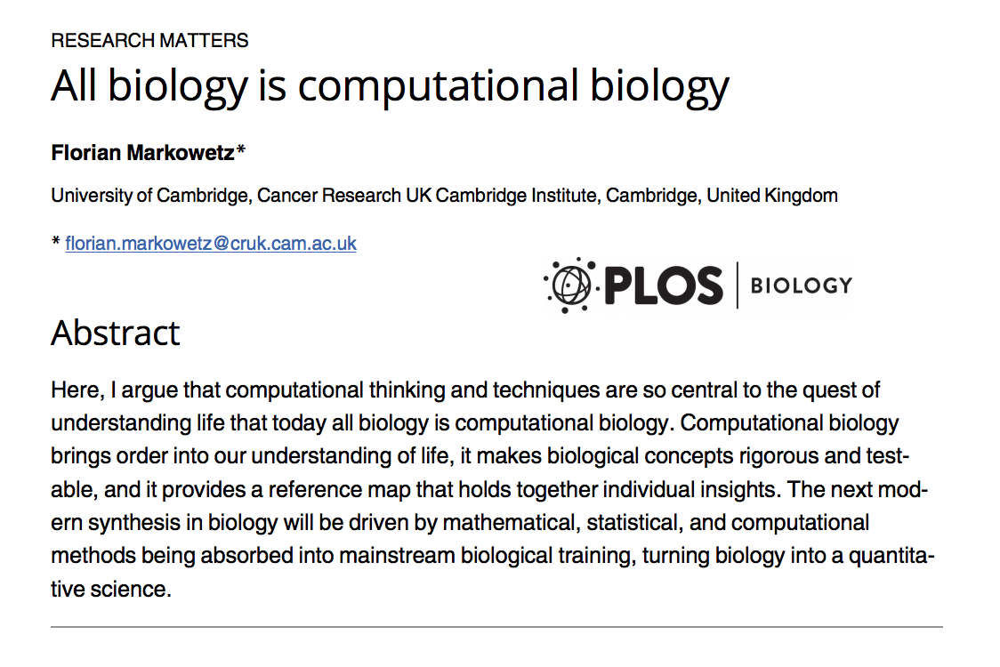
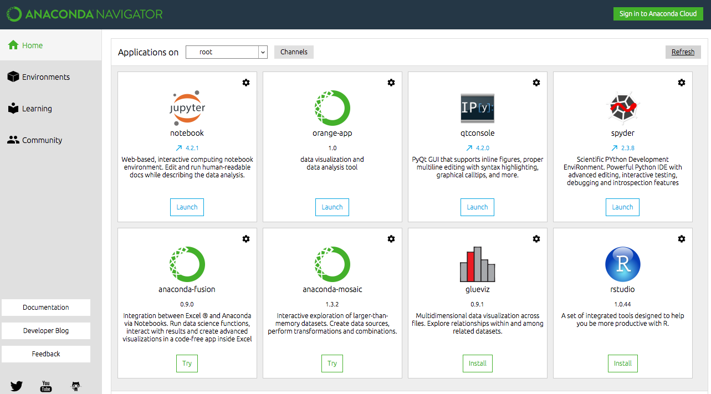
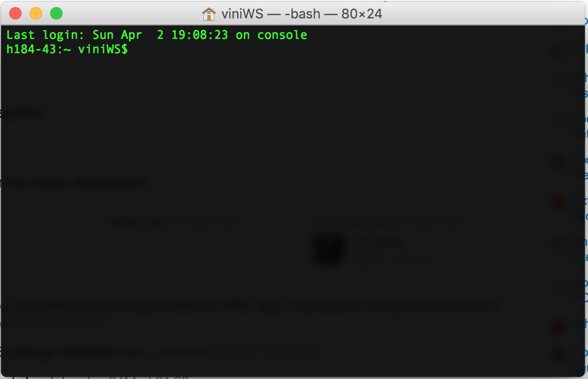

### Bem vindos ao Kit de Sobrevivência para Biólogos no Mundo da Informática
É evidente que, nos dias de hoje, os computadores são ferramentas básicas e fundamentais para o trabalho de biólogos e outros cientistas. Qualquer que seja a atividade profissional, de pesquisadoras de campo à professores à cientistas de bancada, alguma etapa do trabalho exige o uso de um computador. Tarefas como entrada de dados em planilhas, pesquisa bibliográfica e redação de documentos já são rotina para esses profissionais, além de outras mais complexas como análises estatísticas, manipulação de arquivos e modelagem.

No entanto, apesar da ubiquidade do seu uso, nossa formação não compreende o funcionamento e uso do computador, diferente de, por exemplo, um microscópio. Quando nos deparamos com desafios que exigem um pouco mais de conhecimento dos mistérios da informática, nem o mais complicado doutorado sobre filogeografia de nematódeos vai ser mais útil do que alguns truques que seriam básicos para qualquer estagiário de TI.

Se você veio fazer esse curso, são grandes as chances que você esteja usando alguma ferramenta informática que seja um pouco mais "avançada" do que o Excel. "Avançada" entre aspas por que na verdade muitas vezes essas ferramentas são super simples de se utilizar, porém requerem alguns conhecimentos prévios para sua instalação, implementação e execução. Talvez você esteja tendo que utilizar o pacote de métodos de alguma linguagem para aplicar uma análise estatística, ou tenha que formatar o script de algum doutorado que foi realizado no seu laboratório a anos atrás. Por mais que você pesquise e consiga resolver coisas bem específicas ao seu problema, existe a sensação de que você está deixando algo óbvio escapar, e que tornaria sua vida tão mais fácil.

É inevitável, em algum ponto ou outro da graduação nos depararmos com esses desafios da informática. E é normal que eles causem frustração. Não conseguir rodar um pacote, não conseguir fazer funcionar um script necessário para o processamento dos nossos dados, não conseguir instalar aquele programa obscuro baixado do site de algum laboratório que parece que não foi atualizado desde a época do DOS, ter problemas com driver de algum equipamento de laboratório, a lista se alonga.

A verdade é que a formação dos biólogos1 é muito carente de um aperfeiçoamento de suas habilidades de  informática, e que garanta a sobrevivência deste profissional frente aos problemas que serão encontrados. Não aprendemos os básicos sobre o funcionamento dos computadores, dos softwares, ou dos sistemas operacionais. E não estamos sugerindo que o biólogo deve saber fazer as coisas que um *helpdesk* de TI faz, mas sim que precisamos dominar melhor essas ferramentas para facilitar as **nossas** tarefas de biólogo.

Recentemente, em um artigo de comentário2 no periódico *PLoS Biology*, Florian Markowetz problematiza como a utilização dos recursos de informática são centrais no processo de aprendizado e entendimento das ciências biológicas, porém o treinamento computacional ainda não foi incorporado na formação *mainstream* destes cientistas. Às vezes temos contatos com linguagens de programação, porém não aprendemos *conceitos* de informática de uma forma concreta.

Nosso curso visa preencher parte desta lacuna. Não focaremos em nenhum linguagem ou método específico, mas sim em ferramentas e conceitos de programação 'generalistas', que em troca vão facilitar nosso cotidiano como biólogo trabalhando na frente do computador. O curso será dividido em 5 seções principais e complementares:

* UNIX shell e o Terminal
* Programar x Desenvolver
* IDEs: nossa bancada no computador
* Documentação e controle de versão
* make, build

Ao longo dessas seções, vamos entender melhor o processo de *coding*, como podemos começar a escrever códigos para facilitar a nossa vida, e como implementar códigos escritos por outros. Abaixo veremos um resumo do que será abordado em cada seção.

1De agora em diante, quando usarmos esse termo, estamos nos referindo principalmente a biólogos e biólogas, mas também a outros cientistas naturais e sociais, como geógrafos, ecólogos, biomédicos, antropólogos, etc, pois compartilham da mesma problemática de utilizarem muito recursos informáticos mas não aprenderem a utiliza-los de forma proveitosa durante a graduação. Cursos como geologia e oceanografia, apesar da aproximação com a física, um campo no qual a informática já é mais difundida na formação, também estão inclusos, pois sua formação costuma compreender conceitos básicos de programação mas sem muito aprofundamento. Normalmente, somente cursos de 'exatas' como ciência da computação, sistemas de informação, física, matemática e algumas engenharias que de fato compreendem conceitos mais nítidos de informática em sua formação, e mesmo assim existem lacunas.

2[Markowetz F (2017) All biology is computational biology. PLoS Biol 15(3): e2002050.doi:10.1371/journal.pbio.2002050](http://dx.doi.org/10.1371/journal.pbio.2002050)

---

### UNIX shell e o Terminal

##### GUI x CLI
Algo muito comum de acontecer com estudantes no final da graduação ou recém-ingressados na pós é a grande frustração ao primeiro contato com uma linguagem de programação, especialmente o popular **R**, pela falta de familiarização com outras interfaces similares.
O R é uma linguagem usada para testes estatísticos, o que explica sua popularidade entre os cientistas naturais. Normalmente essa linguagem é utilizada através do programa do mesmo nome, que apresenta uma *interface de linha de comando* (ou **CLI**, do inglês *command-line interface*), diferente de uma interface **GUI**, uma *graphical user interface*, na qual o usuário clica nos comandos que deseja realizar.

Interface típica do R, uma *command-line interface*.

A interface CLI do R, como é observável na figura, apresenta um *prompt*, identificável pelo símbolo ">" abaixo do texto. Esse *prompt* indica que o programa está pronto para receber um comando digitado pelo usuário. No texto da figura, vemos que podemos escrever, por exemplo, 'help()' para obter ajuda ou 'q()' para sair do R. Nosso foco aqui não é aprender a usar o R ou qualquer linguagem específica (apesar de que vamos ver exemplos de algumas linguagens), mas é fundamental entender o funcionamento da CLI para prosseguirmos no tutorial. **No começo, muitos usuários estranham o uso de uma CLI, porém com o tempo é fácil perceber como ela torna muito mais rápida a entrada de comandos que podem ser usados para diversas funções.**

Exemplo de uma GUI simples, o Anaconda Navigator.

##### Introduzindo a shell
"A UNIX shell existe a mais tempo do que muitos de seus usuários. Isto por que ela é uma ferramenta tão poderosa e simples de utilizar, permitindo o usuário executar tarefas complexas com apenas algumas teclas."1 (Adaptação do autor)

A versão mais popular da UNIX shell é a bash (Bourne Again SHell), que é uma CLI muito popular entre usuários de Linux através do programa **Terminal**, incorporado ao sistema OS X da Apple. Isto e outras características conferem uma certa similaridade em alguns aspectos desses sistemas operacionais. Há grande chance que você, leitor ou leitora, seja usuário de Windows, pois sua grande popularidade condicionou muitos usuários à o utilizarem durante a vida toda, e sentirem-se desconfortáveis com outro sistema. Mas não se desespere! Se esse for o caso, você ainda pode ~~desinstalar o Windows agora e instalar o Linux~~ baixar uma outra versão do Terminal e fazer as mesmas coisas.

Console do Terminal do OS X. Note o "$" indicando o *prompt*. O Terminal é um programa para executar comandos bash.

Para quem é averso a essas nerdices, digitar comandos no Terminal é quase como entrar na Matrix, ainda mais se houver um fundo preto e letras verdes fluorescentes. Porém, ele é uma ferramenta informática **básica** para muitas funções, como editar e gerenciar arquivos, executar scripts, acessar servidores remotos e ambientes virtuais, entre outras funções. É imensamente útil sentir-se a vontade utilizando o Terminal, e logo percebe-se o porquê. Em nosso curso, teremos uma introdução aos comandos básicos do Terminal e aprenderemos como ele será útil no futuro.

1[Aula de shell do Software Carpentry](http://swcarpentry.github.io/shell-novice/)

---

### Programar x Desenvolver
O Terminal é o primeiro ponto da nossa introdução pois ele se tornará o carro-chefe de várias operações que vamos executar. Quando se fala em "programação" no contexto da informática, muitas pessoas (leigas) pensam logo em códigos complexos e ininteligíveis que irão gerar softwares bonitinhos ou páginas web interativas.

#### IDEs: nossa bancada no computador

#### Documentação e controle de versão: git e GitHub

#### make, build, compile
