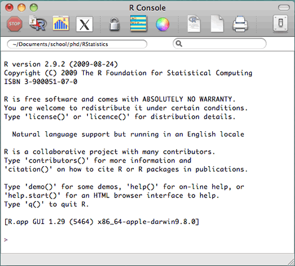

## Introdução
### Bem vindos ao Kit de Sobrevivência para Biólogos no Mundo da Informática!

É evidente que, nos dias de hoje, os computadores são ferramentas básicas e fundamentais para o trabalho de biólogos e outros cientistas. Qualquer que seja a atividade profissional, de pesquisadoras de campo à professores à cientistas de bancada, alguma etapa do trabalho exige o uso de um computador. Tarefas como entrada de dados em planilhas, pesquisa bibliográfica e redação de documentos já são rotina para esses profissionais, além de outras mais complexas como análises estatísticas, manipulação de arquivos e modelagem.

No entanto, apesar da ubiquidade do seu uso, nossa formação não compreende o funcionamento e uso do computador, diferente de, por exemplo, um microscópio. Quando nos deparamos com desafios que exigem um pouco mais de conhecimento dos mistérios da informática, nem o mais complicado doutorado sobre filogeografia de nematódeos vai ser mais útil do que alguns truques que seriam básicos para qualquer estagiário de TI.

Em algum ponto ou outro da graduação nos deparamos com esses desafios. E é normal que eles causem frustração. Não conseguir rodar um pacote no R, não conseguir fazer funcionar um script necessário para o processamento dos nossos dados, não conseguir instalar aquele programa obscuro baixado do site de algum laboratório que parece que não foi atualizado desde a época do DOS, ter problemas com driver de algum equipamento de laboratório, a lista se alonga.

A verdade é que a formação dos biólogos1 é muito carente de um aperfeiçoamento de suas habilidades de  informática, e que garanta a sobrevivência deste profissional frente aos problemas que serão encontrados. Não aprendemos os básicos sobre o funcionamento dos computadores, dos softwares, ou dos sistemas operacionais. E não estamos sugerindo que o biólogo deve saber fazer as coisas que um *helpdesk* de TI faz, mas sim que precisamos dominar melhor essas ferramentas para facilitar as **nossas** tarefas de biólogo. Algo muito comum de acontecer com estudantes no final da graduação ou recém-ingressados na pós é a grande frustração ao primeiro contato com uma linguagem de programação, especialmente o popular ***R***, pela falta de familiarização com outras interfaces similares.

1De agora em diante, quando usarmos esse termo, estamos nos referindo principalmente a biólogos e biólogas, mas também a outros cientistas naturais, como geógrafos, ecólogos, biomédicos, agrônomos, etc, pois compartilham da mesma problemática de utilizarem muito recursos informáticos mas não aprenderem a utiliza-los de forma proveitosa durante a graduação. Cursos como geologia e oceanografia, apesar da aproximação com a física, um campo no qual a informática já é mais difundida na formação, também estão inclusos, pois sua formação costuma compreender conceitos básicos de programação mas sem muito aprofundamento. Normalmente, somente cursos de 'exatas' como ciência da computação, sistemas de informação, física, matemática e algumas engenharias que de fato compreendem conceitos mais nítidos de informática em sua formação, e mesmo assim existem lacunas.
